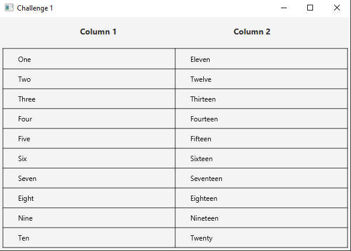

# genspark-group-challenge
# Challenge 1: Random Strings to Columns
## Motivation
This program is our first group project. We were instructed to pick teams, and choose a challenge. We chose challenge 1: An Input File, that displays random strings. We will need to write this program to display the data in a Column Fashion. 
## How to Run
```
1. git clone repository in desired directory.
2. Open in prefered text editor.
```
## ScreenShot

## Code Snippet
```Java
public class Controller {
    List<String> sortedList;
    ArrayList<Text> nodes;
    @FXML
    GridPane gridPane;

    @FXML
    public void displayList(String path) {
        nodes = new ArrayList<>();
        try {
            sortedList = SortInput.sortInput(path).stream().toList();
            for (String s:sortedList) {
                nodes.add(new Text("  "+ s +"  "));
            }
        } catch (IOException e) {
            e.printStackTrace();
        }
        gridPane.setGridLinesVisible(true);
        gridPane.setPadding(new Insets(2, 5, 2,5));

        int x=0, y=0;

        for (int i = 0; i < nodes.size(); i++) {
            gridPane.add(nodes.get(i), x, y);
            y++;
            if(y % 10 == 0){
               x++;
               y=0;
            }
        }
    }
    
   ```
## Tests
--N/A--
## Contributors
[Affan Fareed](https://github.com/ItMeansBigMountain), [Alonso del Arte](https://github.com/Alonso-del-Arte), [Jacob Stout](https://github.com/JediJake66), [Kevin Drake](https://github.com/KDrake80), [Moe Yassine](https://github.com/JintekiWarrior), [Steven Lofquist](https://github.com/StevenLof777)